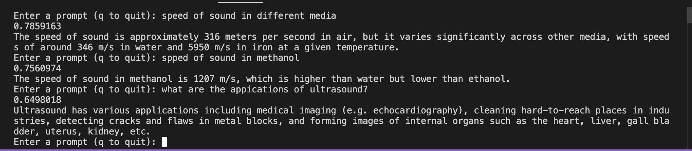

# PDF_RAG_App

## Introduction:
The appliaction here is an advanced Retrieval-Augmented Generation (RAG) application designed to answer quesions on the basis of a document. The application also has automatically triggered agents that can help to take notes and if needed also generate a set of multiple choice questions based on the content of the document.

In addition we are utilizing LLMs installed locally using the Ollama registery, which will need to run on our machine's background for us to utilize the same.

## Features:

1. Using locally installed LLM using Ollama
2. Vector DB querying process optimized, vector DB queried only when there the prompt is relevant to the Vector DB content. This is done by calculating the cosine similarity of the vector embedding of the prompt and comparing it with the average vector embedding value of the data stored in the vector DB.
3. The agentic workflow includes the following tools:
    - Question Answering Tool
    - Note Taker Tool
    - MCQ Question Generator Tool
4. Output of the API based setup also provides a base64 encoded .wav file, which is implemented using the Sarvam Text To Speech API.

## Steps to run the code:

**Please ensure that you run this application on a machine with a GPU as we are using a local LLM**

1. Download Ollama registry to install the model locally from this [link](https://ollama.com/download/linux)
2. Once you have Ollama installed, you can enable the ollama server and install the required model using the below commands in the termina:

```
ollama serve
```

```
ollama pull llama3.1
```
3. After Ollama is running, you can configure a virtual env of your choice(conda or normal python) and install the libraries using the below command, in another tab in the bash terminal:

```
pip install -r requirements.txt
```
4. Then we can use the below command to trigger the RAG application:

```
python query_engine.py
```
5. Once the command runs successfully, you will be promted in the terminal to enter how you want to tun this app with the options being Terminal or API.


6. If you choose terminal, this will work as a terminal application and you will be asked for a prompt for the application in the terminal. If you choose the API option, this will start a local uvicorn server which you can use by navigating to the local server with /docs (127.0.0.1:8000/docs). Here you will find the Swagger UI which you can use to test out agent using the API.

## Output Example:

1. Terminal based outputs:
    
    - Prompts relevant to the vector DB content:
    
    

    - Prompts not relevant to the vector DB content:

    

    - MCQ Test Paper Creation Agent:

    

    - Note Taker Agent:

    

2. API based outputs:

    - Prompts relevant to the vector DB content:
    
    

    - Prompts not relevant to the vector DB content:

    

    - MCQ Question Generation Agent:

    

    - Sample API Response

    ```
    {
    "answer": {
        "result": {
        "response": "Ultrasound has several applications, including cleaning hard-to-reach parts, detecting cracks and flaws in metal blocks, forming images of internal organs for medical purposes, and thoroughly cleaning objects by detaching particles of dust, grease, and dirt with high-frequency waves.",
        "source_nodes": [
            {
            "node": {
                "id_": "e2a22f7b-6f92-40a2-adc0-7b0b4ef4d7b0",
                "embedding": null,
                "extra_info": {
                "page_label": "11",
                "file_name": "sound.pdf"
                },
                "excluded_embed_metadata_keys": [],
                "excluded_llm_metadata_keys": [],
                "relationships": {
                "1": {
                    "node_id": "b0191cdb-e492-4c85-8635-812ed8776537",
                    "node_type": "4",
                    "metadata": {
                    "page_label": "11",
                    "file_name": "sound.pdf"
                    },
                    "hash": "b87041ab2a2b20877bce4f6fbc0bdb6b695279a659c2cc8fcfc4898a298c4035",
                    "class_name": "RelatedNodeInfo"
                }
                },
                "text": "SCIENCE 136squeaks of the bat and know when a bat\nis flying nearby, and are able to escape\ncapture. Rats also play games by\nproducing ultrasound.\nHearing Aid:  People with hearing loss may\nneed a hearing aid. A hearing aid is an\nelectronic, battery operated device. The\nhearing aid receives sound through a\nmicrophone. The microphone converts the\nsound waves to electrical signals. These\nelectrical signals are amplified by an\namplifier . The amplified electrical signals\nare given to a speaker of the hearing aid.\nThe speaker converts the amplified\nelectrical signal to sound and sends to the\near for clear hearing.in construction of big structures like\nbuildings, bridges, machines and also\nscientific equipment. The cracks or\nholes inside the metal blocks, which\nare invisible from outside reduces the\nstrength of the structure. Ultrasonic\nwaves are allowed to pass through the\nmetal block and detectors are used to\ndetect the transmitted waves. If there\nis even a small defect, the ultrasound\ngets reflected back indicating the\npresence of the flaw or defect, as shown\nin Fig. 11.14.\nQ\nMetallic components are generally useduestions\n1.What is the audible range of the\naverage human ear?\n2.What is the range of frequencies\nassociated with\n(a)Infrasound?\n(b)Ultrasound?\n11.5Applications of Ultrasound\nUltrasounds are high frequency waves.\nUltrasounds are able to travel along well-\ndefined paths even in the presence of\nobstacles. Ultrasounds are used extensively\nin industries and for medical purposes.\n•Ultrasound is generally used to clean\nparts located in hard-to-reach places,\nfor example, spiral tube, odd shaped\nparts, electronic components, etc.\nObjects to be cleaned are placed in a\ncleaning solution and ultrasonic waves\nare sent into the solution. Due to\nthe high frequency, the particles of\ndust, grease and dirt get detached and\ndrop out. The objects thus get\nthoroughly cleaned.\n•Ultrasounds can be used to detect\ncracks and flaws in metal blocks.Fig 11.14:  Ultrasound is reflected back from the\ndefective locations inside a metal block.\nOrdinary sound of longer wavelengths\ncannot be used for such purpose as it will\nbend around the corners of the defective\nlocation and enter the detector .\n•Ultrasonic waves are made to reflect\nfrom various parts of the heart and\nform the image of the heart. This  tech-\nnique is called ‘echocardiography’.\n•Ultrasound scanner is an instrument\nwhich uses ultrasonic waves for\ngetting images of internal organs of the\nhuman body. A doctor may image the\npatient’s or gans, such as the liver , gall\nbladder , uterus, kidney, etc. It helps\nthe doctor to detect abnormalities,\nsuch as stones in the gall bladder and\nkidney or tumours in different organs.\nIn this technique the ultrasonic waves\ntravel through the tissues of the body\nand get reflected from a region where\nthere is a change of tissue density.\nRationalised 2023-24",
                "mimetype": "text/plain",
                "start_char_idx": 0,
                "end_char_idx": 2877,
                "text_template": "{metadata_str}\n\n{content}",
                "metadata_template": "{key}: {value}",
                "metadata_seperator": "\n",
                "class_name": "TextNode"
            },
            "score": 0.5211704175289319,
            "class_name": "NodeWithScore"
            }
        ],
        "metadata": null
        },
        "encoded_wav": [
        "UklGRiRIAABXQVZFZm10IBAAAAABAAEAIlYAAESsAAACABAAZGF0YQBIAAAAAP7/AAD9//n/9//v//P/+f/x//f/+//3//3/8P/y/+//7//4/+b/9//z//7/FgAGAP//DQD4//X/+v/6//z/7P/5/xEAEwD+//D/8//x/wgA6v/a/9r/wv/+/8r/6f/K/+D/6P/H//T/3//g/+3/4f8CABUA9f/+//v/BQC2/wIAz/+5//n/3P8HAPj/GAD7/xEAFgD//9H/BgC5/9P/6f8bAAYA6P/1//P/AAAUAPj/3v/1/wUAMwAhAA4AGgAmAD8ABwAbAPn/RAA1ACwABwAEAOD/6/8OAPj/+/8EAPT/pv8oAEIAPADR//r/6f/U/wQA9v8UANr/p//F/8r/6P/P/6r/rf/C/0AACADy/9z/+f8OAM//vP+9/0MACQD+/+D/7f/8/xQALgDl/7n/2v/f//r/1P/h//X/BADG/9X/EAD5/zQA3P/d/+n/w//q/9D/3/+4//z/Rv/n/5P/CQCL/7j/mP/3/97/wv9O/z//7/+k/77/U//b/+P/oP/F/27/sP/f/7H/Xv/L/3j/p//C/6X/yP/h//3/HwBz/+T/2f/Z////6P+r/9P/uv+W/5j/2f+m/7T/rv/N/2L/xf+0/5v/0P+c/5X/xv+S/3f/lP/Q/8T/3P+7/9X/rv/R/9f/0v/6/8H/wP/o/8H/jv/X/+L/6v8FALX/IQCU/8P/3/+l//n/8f/l/8r/rf+9/87/7P/d//j/3//u/53/6f/F/w4A5f/V/8D/sv/+/67/vv++/+P/5f/K//v/X//l/73/0/8sAJD/zP/6/67/tf/H//3/dv8iACQA0/94//X/9v/r/+D/8P+i/7j/zf/D/+f/7P8GAAsA/P/p/6H/0P8EALn/5v/Z//v///+r/8T/8P8QANP/LQCX//n/i//R/0UAkv8lAJr/tP/A/8D/6/+O//n/rv8OAAIA7/9U/9D/TQBa/yUAkP8bALD/sv/+//T/AADA/2MA5v+f/wQA1P8FALT/u/8EAML/jP+g/+v/1//u/8L/DgAlAMr/4P+0//D/w/8RAN7/JACm/+X/0P8cAB4A9f+QAGL/+f99/9//JwCl/7f/m/8dAIv/4f/g/w4A3/+k/w0Au/8vAKD/wP/B/5//BAB8/93/1/9I//b/AwC7/xUAFwDM/+T/Yf/3/9P/JADw/wYA9//3/+3/xP/E/1IAP//t/0QA2v/f/+v/CQDu/xcAr/+0//H/c/+t/wgA0P8hAN//wv8eAG3/BwCo/zcAsP+x/8z/sv8QAMP/2f8MAC7/DADf//z/yP+Z/zEAyv9IAHT/o/83AKr/3P/f/y0Atv8gAOT/wf+J/7//OQD9//L/h/+u/7n/zv+w/87/RgC0/9P/c/8vAI3/gP8xAH3/9v+i/6X/m/9x/4L/df/3//f/aP/W/+3/mv+h//T/bwAQAJH/o//r/8X/mf+q/0oAxv/N/6j/9v+T/5z/+v/m/9X/cf93/6L/FQCE/93/KgCS/7P/LwDZ/zn/wv/8/1kA0f/d/7j/rP/e/9D/6P8sAMz/5P/+/9H/rP9U/zIA3f+6/3z/3P/D/6n/gv/r/2oAxf/w/8z/4v+f/6r/QQBAAIX/z/8MAMX/7f/z/9H/DQCL/3//HAC9/2D/of9kAAwALgBx/y8Awf9z/+3/HwAwAH//WQD0/7L/0/+Z/+P/AgBg/zUAPQDF/2r/4f/j/8r/UP9FACEAmP+O/43/9v+0/8X/sv8vACH/af+P/5D/8/+l/0sAQ//8/9L+4P9RAHD/iv98/9H/Xv/N/wsAdP8DADX/OQCY/ysAWv+W/ysAjf9NAHf/v/8KANT+KADC/6H/wAANANf/cgAV/3kAkv9TAB8AJwATAPf/AQC5/x4A//+w/xoAXQDG/7j/WwC9/7n/NQDV/7n/AwD9/i4A2v+k/wYAJQBFAEQAOf9WAOH/zP8WANH/GgC7/9n/UQBE/zMAXP8dAEcAHwBw/7D/cQCo/+r/p/+a/14A7/7F/83/NQDd/0EAMwC9/zv/PAA0AHn/JQDg/ysASQCT/yoAuP/K/+//6f+F/1cAiP+z/9j/av89AJT/EAAUABH/rP+T/ykATQCW/ycAcAAk//f/6/8qAAYAcP/y/xsA0v/C/3//EwDG//H/JwC7/2T/x//E/8z/8f/D/8z/9f+//9r/a//r/4L/3f8yAK//WP8rAHD/LADX/7T/pf9DAPX/0v9m/+3/2v/g/ysA6/+B/7T/IADu/+r/XP+MAMP/1P6i/7z/JACS/zMA8v8pACv/FQDl/8n/tf8y/1cAQABw/w4Ayv/W/woAav9lAN3/E/8cABIAyP8ZALT//P/a/wn/AADZ//z/qf/0/ygAfv8TAAAARP8LAOP/SgDK/+P/fv+1/9z/1//v//f/MACs/03/iv9+/9H/8v/5//b/Uf91/2D/qP/l/7//iABv/6P/0P5r/8//eP9A/0P/aQDf/8P/7f+l//v/tf4bAFEAFAAsAA3/vP8RABUAT/8SABgAfv5IANb/zP/BAEYAIAAIAK//2v9K/zwAfADY/5X/OQAQAIf/kv9ZAJ7/6f9tAP7/6P9VAIL/7v8HAIr/fP8CABL/mv8DAPj/1v/X/wMAbwBG/73/yv9aAGv/Qv/G/4X/3f+D/2IANABi/yQA2v9oAPj+R//JANf/+v9A//j+uv+L/3z/gv9FAN7/NAAwAIn/5f7g/5EAvf+p/4z/hf99/4n/0v+u/2AAsv/R/3z/KwAX/wr/mwA5/7v/2P9O/7n+2v42/0D/LAAiAHn/LwD8/6D/6v9TAF8AfP+L/67+X/8H/6n/x//D/7r/+f+e/2n/df46/8z/hf+d/4L/fv8P/9P+pf/h/9n/Bf+U/+r/kv/o/cj//P8RAHL/nv8k//v+r/4bACsAY/8CABQA7v+l/3X/DP8eAF7/zv9n/zoAiP8//k3/5f9SALn/0/+b/wMARf5e/2sAdP9L/xb/Kf/9/rX/BQDr/xkAqP/n/xQAHwAq/o7/4gAZ/0UAFv+R/yX/qf7b/3T/bf+8//H/cP9c/5v/iP///1T/8/7g/2X/yP6k/ob/ff/3/nT/9v+G/yb/9v7H/vL+Hv/e/4T/kQBC/qn+LP9K/6//TwBVAJn+LgB+/qD/FwGA/w4Alf/s/sf+k/8iAEb/i//i/3cA+/7FAG/+Yf8mAPf+pAAN/ygAGAAJ/lwAUf8S/yYBqABH//0Ab/6GAF7/M/+o//7/R/+U/zP/nf8CAAP/2f/+/yUABP8f/9X/X/8P/6AAdgCX//P/D/52AIf+yv5Q/9kAaACO/xn+IADqAGD/JgCF/+b+Of8u/1QAbv+5/60APwC8/0wAWP4HAD0AZ/+N/+X/L/+x/1L+n//a/vD/QgDRAGz/NQAH/5cAswBN/+X/3AAM//b/KP99AE4ArP9YAYkArf4iAWT+2v8TACv+8wCDAHP/0/8J/hQAsv5i/xQA//+9/50AaP5MAOn/7v/F/5T/5f6G//T+Y/+F/0f/rf/HAK7/+P/m/dL/BADr/eMAUP8b/5r/6P5iAEX/RP+H/0kAxf+x//79lwCt/wYAVf/V/73+1v8F/2n/6f8IAAcA7QBbABEALv76/04Aov4tAb3/KACz//L9sgAm/1n/AwDUAP/+SgBs/lkA5P8D/27//v/v/pIAeP5WAKX/rf+2/yUAFQAuAPX9RgAYAM3+4QDX/+j/HwAd/mwAxv8X/zX/fQCx/xn/If8QAJ3/M//o/m4A8f6B/6r+1/9T/wX/kf+NADcA0P7J/ln/O/9Z/3cAFAC1/8X+qP4u/4H/tP+T/wABCP8V/0f+N/+H/1b/ef5l/3T/+P/o/pf/hwB6/+j+gwCTAK8Ay/9P/yv/ff9SAVz/1f8iAPD8+ADV/wT/IwHHADz/u//J/g8ARf/V/zgAagD4/eb/CADH/ov/MACg//r/qwDx/wz/CQED/0b/ZQDl/xv/RABd/u3/OwB1/3wAdP8YAP7/Vf+5/57/6wAG/7b/Pf4r/wIA/f6r/zQAFf+RAAj/TAB1/i7/bgDy/h0B7/6A/Yj/T/9k/xr/LgDH/0oAYf8K/37+gf+rADf/iv+W/0b9d/80/zT/jv89AFwAs/+u/2cADv7//pAAkf6PAKIAfv23/ub+Pf+Q/ikAjwAB/z0AGgD4/jYA7wBHADv/KP9K/SX/Qf4g/1f/Pv/d//b/x/4r/2394v5N/1X+tv9yAGT+Ev6k/3b/Rv8ZAHz/Jv8YALb+5P7I/gYAFACJ/9wAVP2W/mX9XgDB/y//MgAr/5MAr/7Q/sn+i/+r/8n/sv/h/nv/9v1m/w0AmP/X/wAAsP/E/xr/3v6uAKX/0/4WACf+GP97/wUA2P/q/0b/f/93ANz+7f0v/8b/7f6AADP/8/5q/v7+Jf98/+//+/59ALf/FP9T/xQAEACe///+Tf81/iH+lf3k/zj/nf60/joAzP/5/pz+Ef5P/zT+//97/9b/4/0o/5f+X/9qAKv/dQG8/v//bv0QABYBX/+C/97/kP3N/af/fAAw/93/Nf8ZAUT//wAP/ZX/GQCn/bQBHv7p/WoAH/16ANb+9v4aApoA7/9WAaX9KAGU/+j+dwAiAMr+Wf85/wv/ZP4C/5P+uP+L/4n+EP5c/zT/CP8VAUQAMP6f/xv8CACu/cL99P/n/vn/IACO/dwApQFy/0z/t/+r/bD+9/6B/yn+AwCh/9b/WP+pALL9jv7eAI7+KgDx/kb+uQD3/av/Mv2xACUACgB0/9z/FP5CAFoC6f1sAGIAy/3e/y39+P/h/gn/FQDh/5f+hwDU/Nv9sf82/ewAPv8a/+r+Xfzl/7z9uP44ALz/c/8QAHX90v7h/q/+vP89/3X84v0t/eT+t/46/pH/H//Z/mn/iPs9/4r/U/6FALr+lP7S/rf96/8d/q7+hP8oAGb+/gDt+9MAfwBH/4r/nP+M/Mz+eP5+/n3+Z//S/ygAsP/x/8r9vf5GALj9lgGB/hIAXgC7/H8AMP52AUf/4ADL/7wAlP0DAAQB2f7R/13/Qvy6/wv+XP9Z/pz/2//x/9b+hABJ/JD/QQBe/QUBzP7R/WEAtf3o/yn9W/8v//D/Hv6C/3n+nf65/zb+Zf4DAFX93P6X/Fb/RP7P/kT/vf/A/h3/jPwh/pz9g/2FAIL+cP94/a7+hv6f/mz/u/9xAWr8XgCl/dX+DgBEAET/AwAo/RIAif2SABQAmADk/1UBhf8pAv78q/8x/yr+9AEy/j7/jwDz/DgBaP7X/t8AiQFY/RIBq/3z/nH9/f5W/hn/af1Z/zL+U/0LAPH+jP4lAKL/Cf9r/tv/tf0t/40A7AD2/YQBCfz+AMn+FP8d/9AABgB1/x3+5f7j/4AAu/65/lD8If+b/nv+BP/b/3v/lwDT/pEBJv1s/7//8v6TAGL+rf2SAPX9v/71/rQAlwDpAJL+bP+X/bP+mf+c/RcA2/0j/JD/G/2D/d79sf0oAFb+uv2zASj7tf5i/4T7TAEg/1r+Xv7V/eD9P/33/mgAv/55/zYAJf7s/hL/ov8Q/+L+K/xH/iX84fyA/MX8O/9q/Qb9o//E+ln+Zv5F/BgB4/0r/dX9q/8g/yz/jQAj/7gALf7D/2z9ff4pAA7/WwCzAKj6tP/L/Sv/G/9n/TkAjv/A/kUB3/3X/lX/XP0cAgX+ff09AaP7SgBR/z4ABwGwAD//1ACF/jP93v7b/vz+HwBD/EP/Iv6T/Vf9BPwz/uH96f35//P7sv4AALz8HQIs/d39Nf3k/SL+w/1t/k7+aQB4/T39Tf/A/pX+P/0k/gL/jfqD/Fz7iv1Z/c39iP77/S7/F/2c/uL+YP9O/fUAi//F/X396/+a/zgAMQHUAfYC/fu3/2b87/8s//z+5/6oAef7XP+h/j7+x/3L/Nj/+f7O/0AEVf0//yH/Qvy4Aiv8zf2D/2b+2gDh/V3/EgGHAy7+SgLM+vL/Vf6G/l/+8/8y/3X/wfwJ/bn9mv/R+t79QP1F/eL7wf4L/q//MwGq/k37CPyr+Cn8+f3F/Q//eP1h/pECPfzuAO8BK/+N/Gb/Zvva/Bv9cvq3/D78aPz6/Yj7BQHx+MT+GP4Z+s/69/bO+DUBWvyx/Un4jv1e/L/8avqm+lH5e/s3AWD55f88AN/8WgAP/GT8mf3E+xL9Hv6u/HsDT/60AKoBkPu1/Kn8L/wh/bf7Qv3i/T4AsgJl/ucDdAIn/yX/1AB5AOwBuAFt/PX9pvx1/jkBuf/uA7MA4AB4Aoj9UQGjATr/Ff6/+2T8sf7z/kT+5v1B/NgABQCI/a0BE/kb/hMDmvyD/vD7m/qCAGoC6v0V/SEA0gEpBHD7iv8N/cX90v3t/Gj/OvoVASkBFPeL+pD5Of9s/X3+9PqJ+PT3qPyhAdr88vcO+Er4o/ki+ez2OPVX+C39r/75+Cv6F/hC+4z6mPQn9lr3Ifsi/a33yvgj8YPxrflj+ezzvPcC9az1+Pci8L33wfn694zxHfUQ+Bv70/v4/f/+Xf6M/QX8DP8y+TP7xvqb/kf6RPjz+Zz9qP3s+ML4l/kz+yb9xwG4/sD8SQG7AM0G1f6N/SkCqwPr/m4EkvodAzcDFgX8AMEBmPrx+1sANP+dAbACCgCaBlD+Uv0SBHYG+wNGB0IBYQYZAk4GzgSwCEoFIgFA//gAlQdWB3oHKw3NDwcNMAlVDmgMFxKaEjMQ2w4aFwEVahvDDsURrBGlHA0bChuHHi0eUSfGJY8jIyUNIEYnOCtGKBsfmicgKkcoDSYgKMMulznyMaEwDykLMUk2ZTeiMWM2pTjDOWg34jrvL7wwnzJuMjku0CUHIhki+CBMImEbNxdsFAUUwxOSDVoDu//m+d/2xent4VTgXuIx31nQMMYExt+/E8Shvqe3aq16qiCkQp5BlIeSsojEiCCH/YAAgACAAIAAgACAAIAAgACAAIAAgACAAIAAgACAAIAAgACAAIAAgACAAIAjieSIcY+SiwKca5+hqOSnsK+jr1jANceuznjdNOu8+tkG4QhIEB8VpB9qJtUw/zD6OztEnVLDVwpjbWfFfLJ//3//f/9//3//f/9//3//f/9//3//f/9//3//f/9//3//f/9//3//f/9//3//f/9//3//f/9//3//f/9//3//f/9//3//fzB9bnI6ZzRV8E2XQFkolSMMC/gIMvQw5vnR+8d1wYiv6KV2oXWUNIUAgACAAIAAgACAAIAAgACAAIAAgACAAIAAgACAAIAAgACAAIAAgACAAIAAgACAAIAAgACAAIAAgN2KwJFGoCOphMJB0BnbRfAc6q/7AfddBB0TCiVlJxs3DUDXTkZM8FR2YEhpJHv/f/9//3//f/9/unL1cb91/H7/f/9/AXcid6R7i3uVdwVvJ2jqYFVgjlZ2T1dOXkkBSR80ZCJ5FhYIrwztEv366OxX2NjRgsAhu2+6VrffrICoa5TsjKKD5YMAgACAAIAAgACAAIAAgACAAIAAgACAAIAAgACAAIAAgACAAIAAgACAAIAAgACAAIAAgACAAIAAgACAiIW1jRSSMZZDpce/r9Jv5j/xvfdtBykcSyyvNkRK8FXZaRR4/3//f/9//3//f/9//3//f/9//3//f/9//3//f/9//3//f/9//3//f/9//3//f/9//3//f/9//3//f/9//3//f/9//3//fwB3c3AaXSVR3DzeJPkj5yStGoQRGf1Q8RrnbeYB1Z3GHb3puXqx5qhemZyV4ogYjIiAAIAAgACAAIAAgACAAIAAgACAAIAAgACAAIAAgI2DJYJbhlqAZ4bKiWSRRY/PjHOUHKFjqRWx4aT8rr+rnbkxthG46r4awdHKIsuw3EzkrODP52vjT+3l7cb0Avf//xkC6gEZBjgQxhGpD8kLghBfEPUUVRf8GnQnZTDKPidFnz+qRhhRZF4AXw5mA1hfYjJijWkDbh9zxnWyd/lww3b6dWF7IH5nfQh8RXK1ejlzQXn/f617Bn/Aa79pGmadY/NQKlBSR2RJgj0eMucsvSv/KwYiLBe8DvYMEA4k8BrmoNeS0MLQpcwTu0+7ubV9sr+gn5NniHGG14AAgACAAIAAgACAAIAAgACAAIAAgACAAIAAgACAAIAAgACAAIAAgACAAIAAgACAAIAAgACAAIAAgACAAIAAgACAAIAAgA+ObYS6h9aKL5gkpg+kerDtvR3DMdIR0+rYCd4b5974JwKQBVkZwyPyOx5FukaYUQ9hOXX/f/9//3//f/9//3//f/9//3//f/9//3//f/9//3//f/9//3//f/9//3//f/9//3//f/9//3//f/9//3//f/9//3//f/9//3//f6t/knUcckVk41LKSf5E9Tl3Jcwgk/4u/E7sPtzQyVW6zL76v7uwRaaEnA6Yz5OzkL6BAIAAgACAAIAAgACAAIAAgACAAIAAgACAAICBgb2CAIAAgMaJ95jjpm2wLLFrt2zHe9rK3xrpC/WTBs4SyBqbHoMl7zaqTTpQrFoTTBhgDlxJapJj3WT8b0dvuHGFa85w3W7yYwZgoVgPW49OkUagP9w6UTXdM/Yr2i0QHKIO0gDX9YbsiN+44hrcHNtz2CnMVL4mqy6qe56ZmsGK9IYAgACAAIAAgACAAIAAgACAAIAAgACAAIAAgACAAIAAgACAAIAAgACAAIAAgACAAIAAgACAAIAAgACAAIAAgACAmY5vltinXqliryW7BsgI1LrHps5V1ODlZvI8AJf6jA6hFjwjSiYjL5M6IUhHUYxXE2P9df9//3//f/9//3//f/9//3//f/9//3//f/9//3//f/9//3//f/9//3//f/9//3//f/9//3//f/9//3//f/9//3//f/9/rHxEeDlzNmEKWh9UO0hRQqs4ci9uJeQdvRubFFEJIgtJBBMIEvzS7R3nbupt7Ozl595g2szRzNXt0hTT9ss60QXPk87ByaDFBMPPyW3HxcPtweXGQsfRyCrFzshjyqXP984+2bbMNdqs3NHfS9vg4qrkAuj25Gzmz+a/8Hnz+vNA7jHxdff++T7yp/Yr55fqcO5d6sfimN5O6AryLudE55nhoON34mDmq9mY1EnbQOC92EXV1st60HrK/dGRyXHJpcfTy8LVytKiwxXC4sgvzrXRItD0x6jF8soV1rnSf9Q/1s7dauJm4d3iY+J17Cn2wfmv/Dvx1f4A+doKlgXgCIMP5Q/lEzkTNRwzIGgbAB5qGdkg+Bw/H+wc9CB1IE8eYyMLLb0jgR4AF9UY6xoQGwcmzB7jJN4sZClkKPYadB0FHNse/hW+FfgKLA/vBEgG6wYUBaoEqwFB+nj3HvhL9yH9xPlH8tvnwOl54hLplfjn68nsT9sr32Ld/91w0jPW29es3sjbsNf62GvaV+Hc33Hb+9fw2+vl+NLo1GvRatfs3r7mCd7/5gfkCekz5L3ieOh76kXvFvT48Vj8RwD/Cd0IjgMYBQYCEQg/FDETdRJdFPMR4BiNFxEi8CgFJDQrLie8LX4pEyptN300fzlxSEFB5kRPQrpLhEZgS/RA0UenSPhI00zMRSVELkQNPQY/oEATOWI4DDQvN9E6GjNuNyQxXzlbME4ncyMgJ7EkJiMuHY0eAxaFFZcTyxA3D/kK0Ar3BRoBev0p9aP6WfPB65DrDOse5jjkw+AV41Hfm+Fk2injhdjf3U3bkNj905Pa4daa2NrTltH81+bcN9tt3KjNINJm1RnWydRn0wjRCtZY4WDaHs1u19PY9eTp0qnYoNYd3PDZmNU40brQquIr5lzVJdqh06neHN2U6Pzqmumc79/zJvfE8XfgXenv8zP69/bi8irm2uzO8Kn4c/Ph9Jr3xP0r+N7wPu4/8QT+HQNP/9P/SvPk/bcAVQtGBtYKBgjrAQD/+QFFCo0PcgwYCmQWmB/lG4wUtxXYHHsjqCsoHEQajQ4+EMoW3yTeHrojwiHhJ28cdh0jFgUSRyR/J3YsMyvLKKonRCAyJc0b5hn+IE4iUx/jIvYYIRyGF28YKw8hDnUCmQcFD3cRsxDiCgT/dQRv/70AmgNk/m/yCf2O5zXoUNs42CvfSN662V7Q/teM0szNwsiMyj/NS86IzjrFMNHAxsPJwciszyLSLdw61kHZP9MJ4Lri8vGq8pzwR/XM+ef+9PqQ+d3+IvYU/MgGVwvVB5MKjA/GD74kYiZ4MN0xACM0K5UnOzXgM645hTIOQDk/i0CPONdDEz+/RphI4ED0QsBCEEulTdRF1kSfREZCPz7sOjM4hDYQOeA6azIiN4wtxSwOL/Ur2iU1H54XDB46EmIVAwq1DYgOLgcHAxP9zPXv87fwrPWw7/foCeYS5dPfpeCD4Nvgd9rP2R/Nf9SE0ULNHs7YyaTLj80QxqbPrMXWxozFYMxSwYTKjsjkzCbRudH+0jvVStKn2bLWb9xu3Z3npt8y4afi4+gR8efzHPAW753wMvmN/YT3yPAi/sX8TghTAJAIcQ1UBgsPUg9XAcQM2wcXES0PbwxGBSAL9g7BEDwRGQ4xBUUIowDBCOv/6//sA0oE7gH0+Cr4Ffh18v3vPu/c7X/efuZp2grchd6q26DgteCT32PdxNyb32Xd1da526Le4uIo5Pbaw+GO3bXh597y4pLcnNw23mTexODa4x3rF/Lg9fHzg/iL8UX32P5y/EkFMPrtBoMANwxCCjMJegyFEEMaBBuqHp8hcBlbH+wkrSWoK8crAy7tNnAqyC0rLcgv0SpvMZ4qCjEdJ90seC29Ms8u0iZHK7Yo7S74I64hLCeQI4slnR6SHsQaqiAZGnUWuBAzG+QVYxmuCKoH2Qm/EcALCwbvAg4BfAOgALv5ufnM9AL4OPrQ86ftQe6Q86Xu5vBZ8LTt5/bH6qDs699y5ZjlHOq844XkNOdy5k7prOiG4R3nXOO16M7gQuCy4arjiuYd6R3oquVV6i7o5+xO6mjs5PBs7Yb1fe+d7zvxnvRu+WL0KvdL+SP2B/sX/ur+nv0N/8ACFQQsApECkfzBAZEEdgW9A90COwcrAdYHUAfuCPEJEgNkBu4G9gQgDSIEzQEaBW8GZAej/tn+nPx+CNsE8AAG/icB4P+8AyIAeP5Z+G3+rAHGAWgAoP/7BiEGXwEv/zn+ZAAbAhQChQAf/qQB7QQF/tMBe/yMAjcCxgRdAs38Vv+tAJH8yQAz9jP7SPw2AwEA+vtf+6T04gAk/uT+h/8c+gL+5/q++xr2avit+jH6eQD4/TP4Fvfx/nMBUfxv/DP5yvvX+HH5OfgV+sz4uPdyAHv/MAbS/BX/lADoAtQCrv5qAmsAwv95AJMCfgS6A0QLcgeDBEMFHgQYBCr+5AI0B0QGbAOECCwIwQpbBPkLLgYeBnwGagYZ/8cBEAY4CCEKqQkaBvsEAgyoCd4KZw8YCRwN/AQQAYYNHRGNByYPiQe2DH8GswhFBjoJ/AsaCGkGMwVMDJEF8QNzCFIJDArpDUcMpgMqC08IFgRh/wMECQYcCtYCRf9lAmILDwgZB3kDRQDVA6EBFAOoBDD+owGvA7kAz/2v+5oD9v65/pz+9/2kAg4B2AC1+TH74/nrAN/45veu9Yv1gPwI/uX1evUk9xP76fl48h3zf/Io88T0uvMH8W/y1vAf+RH1qvPE9T3xrfbR7j3qfOtQ8GLzY/Dg8k32MfJE80v1TvK783vyFPSl8+zy/vA478L00/QH8rT0WvY5+ND0Cvlz+DH8Xvop+cX8nPxt+9UAdv+u/mIARgOzBEf/Uf0yAIMHyALgBHwA7wMFBi8GyQm3CEsEoAiECPgJRQqbD1kUYhJyD7kKDg/YD8wQnw2DDDIO2hPbFN4OlhGxCtsPUw11ER4PhguZEh4UFQ1nDVUEKQpTC4gNuwfEA30F0wPcDrsMQAe8BsEE4AhaA9D+lf/XAIID5QDZApQBavqv+pEC1gG3+Kn6vfdU+uP4E/Zc9gz4FvX/8qj1Bff5+4b0t/hG9oj3DfiN8uL3m/KH8uPySPU79ALyHPhT9W30tPCH8Rv0LfEy89f1EPWM87345fZn+zj4ifvT9qL8lPtl+qz0kPpoAP7/nQE2Aub9sfs/AmIAagFhA4MCWQoIBAb/YwmjDGcIww4vDHESdQd7DwoKGhCMDuMKBwm1CJAUCA7bEEUTmBY6E1cTVRFDDlEXhRYCEwwMZxLuD5MVggwOB9cJ2xRyE/MPrA4CDuoQqBLAEhUTAwo5EVEVTxJACfMOdxJLEhALkQfnBXEKEBEcDSwIMwhTB+gKEAG6ARACogMlC+wJXwHNABn9fwOOBNv+EPy597X4pv4j+T3yZu9379r5I/n882nzkusQ8JjsOuQL5ePknO5D6irpKuhF4A3kseh35wTlIuaX5tToIOjg4vnk9uS45ijjbuRM6G/s7uqz7hXqw+r06+vm8us75mXkVOti7DTpCOss9mnyr/f+9FLz/vm8+rj9c/gd+aT8oAEMAsUFWf0MARwB+AR0B8D/LBE8EDESPBb6D/IS4BEhFcsSoBDfEEIUGxePFZYPCBZnD1AVlRJUEboUphXEFH4YkBcKFQoYSBjQF1AZThhLFA0YaBjWGY8WkBPuFscVdBbdFxYWsRADD2gTOBHkCZUJFQjOC/gH3AJQBnkDzgBg/vkC2P8i+k/9qPch+HD52/Zd98T2s/j/7gPwTO5Z8uHudOxk7untCeuR74nqBe087mrv7/Px7GHssu5m883xIvRE74r1WvHh+D7z1fIT883wv/SR82L55vnE/XD/MQBz/IkFXv4RA2AO2wpDE6YIzQkzCZAQQwmHDzYNSRa+EN8P8wiUC1MOHBHYFGcOZRJtGy8JlQseDXsKQhRQEnwMOAx1EhESORAYD28LqQuLCIwIKgVrB8EF4whaBuACegUu/8cA5gmfA3L/QPpy89Xv5usM85b7sPee/qX2+/Sg7i7poOuO5F/goua36lbk7uPo5Y3kOOqY32LkYNov2p3iNNh25EPj0d8G6CLihOHn2bzX4d5T5OzjCeiH5A/v1/KY6nfowugD8Cnv6/qW+FT38Pmy+xv/HAATCiUJLwrQDNUIUAs9Ea4TDRBXDhUTvRTtFJ4YYxwBIGEkviQBKLcaFB4HHg4gFBjgI0shySORHiUUcRcPEXQYzRxbEkAUARkYF18XjRUJDGERxhWdF8MIlv3xBDYTmxPZEiMNkgquE3wXcRAfB5cLQxX/C0QPYQaCDJUELgyuEHEQwQ0BCRkX4BkCBpwBXALxBnYU4hYnDvUK6AyUFnoR4BGQCvUMUBOdDDQEOwCpBt8RzBOHE28A/QeeBTcNJQG1/rcCY/vm/bT2j/vN/bT4jvEP8I/wffAY54jlEeqi6pTzQ+kJ7pXgeNrG3TzgyNtZ2JXaBdvd3pbic+Gl2rDcEuQt6R/pT+To5Era9uXD4uXeq+yx77P14PjX9m33Jfn4AX0JHQRtAREGiw2kFnYTsR3nC+8RzQeRCpEayhxyHBwkyCIDJc8fihrwJKclOiS5Ij0hxSTHGoUUDhCFEkgUjg7mCToTswf4BeEBwP/M/tkBDQe8BPP95fxS9nP8dfTG9sXt2/MF9FDtUvIp8CDqMuvz8WD3GvaU+7rzoOaw4sziee+E90r4efJ+8zT/6vi+8uzpbfP++k/+xPqJ/bL3ov/dAfQC+PxG8XH2C/eb9Wv5BfDD8+Lz2PSS84zudOge7Pvmz+iC3r3XL+Av46fngNuk4urkTeA06SbeaOBn4TvrIeVy5STcQ9ia3xbltOrC7AHxOPSh9UnyM/Li8rj3Cfd8/UkDPP8QAfwDVgpJBacMfgyIEUAPMA9BFOkaGB+cGQ8cRB/EJowqfil8KKcchCgkHGQhBCCHJ4ktZywOL9Eq0i0uLLIu1C4TKh4tVi4CMKQvyS8IK9k0gykDM3osZyZLLUkwSS3DKRIn1CdSLKkroiV+JqgjGB9zJEomUiL0GtEXHCD0G74ZxQz7EY4NzguMCRkDJ/ti+TX+NgAB+v3vQfDI7gbss+gC6D3miNu+4CfYXtzK2eLSWdLy0D7UT9Lry4zO3s4myw7K5crMxwTFYsuvyXfKyspzz9DQEc4Tz0/UG9kc1pfccdGD1ifWb9vy1MnSqdzS22/W/9sc3Qnhut843e3dp9sX6GHmj+dz7S3pEO9S6Q/qtup88envfO7t8aL5u/Ey9n7xTvJp9+f9EveU+Ib/QQaD9pvz8vkz+PgIcAhp+Sj/C/+8BH0HxQXRBQcE/gn8BxgJrRGmEdASRBGZDsMPRwyOGUkjuxmyGxoYgRcbEusTKB0SI38jACq3ImwjCyXSIb8mfyLUIpgo7SUfIxkmpSW+ISEncSEqJvwaPx2WIi0Z6h/RGgwV0RjqGS4X0RFaDyAUMxkEFdIT9Q1zE+IWHg6eBxQJ5w1xDUAT1ROLCmYD2QhVCycLjgrUBikIdwvxAyQBjQFXAS3/RPjb9P3vB/G18t7yHfJz8aXye/fv6lnpAO268I7m0OmY8hTrM+2n7Tfl/OVC53ns+ejD5KHoT+fQ6enyNudG5RrovOtR7TviLefu7qnwJPIY6rzrZukh9FPtdu5A6ejuKvQJ9b3ySPZK7pXvYPDk9Rzxz++B+5z81vcZ96n8IP/RAHIDSALzAZMBqA6eC8AOZw0dDnkQ7Q8NEHgP7hTxFrAZ9xjODjQaORPNG8wVgg8mF5AU+xYrE4cY1hksGMQWThNTE6QQRhM4DrcWcBVbDZwW3hL5EpMMBwb/C34HtAWaBiH/svpv+PX7bf3U9ir38/+z/JX8bvvN7bHuFOmp7nzol+iV5kDjyObt5Uzkpdvw3+Tif+Gv25LYA81Z1njr1eZq6uTX1NaF2Sjg99aR1APSK9Y42YraZNvo3yXl6+As5HjipOd/7z/nyO798F7u3PQ8+uT5lQIOBWQLhgagBH0DZQfZBfEN3glbEgwZ1RkpIdkZ2huaFBcXpSKHJ1AmESr/IgYtWSthM1Q78zMzPms3zTj3LdokZStjJc8sNTvVNMsuyityNXE3wDcGKn0oByzBK6QyDCZcI+cjtxx0HW4YhxXND9wHPxL8FvIJrQzxBxcQ1goB+88E2gn2DRwG4wBOBPr4Ffpt8qP2IPB69BLvRO5B77znoOjz7G7p3t/z5hjse+1x6rjprevN72LylPQv/G3vwPkX6872Wu+I+3f3T/l09iTtifsE/q0HcwgNAP//wQI8/Xj+yf0y9QT9pgFj+/3wWf9CB4gLavY09lX7oQKEA0n24OzB7YoFfQGD78npHuak7oHfyewZ5GfbVOM26SPqftszyafIVNnW4ZPdTtlryp7OUNGZzqHLoc1F1p7gOtSOzibJUtML4fvid+RD4LDapOuO+HH7Wvme/jAHHQDH/dMA5AmuDnEHFwx9EYgckhfIEi0cNCNLJHMqJyJYIlEW6RdlKXYw/TFqNbs+AUXcM8MwPh9OH+wrYy37MVoxgSutIa8kSixXJcgZFh0QIosdyxmTFRsS8Q5kDO4Dgf5d6yru6+z+8+bmhN1U3Uvhvd7a3RPkPN5d4Unnn9vm3L7TY8y51W/YRc8RzzTOF9qs1ZzL2swsz+jaxtqi2vHdZ9oh4h7l++T24Rbsdeb367nd++RM5j7zve0w7Oz3IvZ6BccASAMvBkQCdAivDdkOHQm3CocRmhJuF8cV+h0CJ1whERkPFSQi0CcuKuokDyiUMTQwTDDONsQu+DAvL2EsOS1DKHsm9inqKnEv9yhKI20iWCDCI54iUCKpIAYfUSNlGRgT2hT/GJgdZxUaErQOcgb1CssHRgviBSMDhQfSAywCpPu4+OP4nvxC+N32fPUA8dXu8fCs8mb0Be9B68LtuOk575DwDe376PHsBu6d7AXqYuvE6Ub1VPXR6bznauq871PxdOuk6v3jT+n67AnmcuUl7Gz30fSo56HqZuYT7jzvauwS5snkSPFy8JntqOk75xruf+aF7ejtFesU8izynvU79z7pVe5Z9Lv8WvjY9NTyVO8I+P/5efnD+IP2off2+Wv44vJ09nz9AfreAhf+Pfw4/z4FOQx+C/UGkBJ+DIMQNBABD+QRBQqBDXUP+hLFFh8RQBO3GBUamhhQF54WThncETMSqhE+FsYT6RzhFeAQzxWPFG0U9A9xDFgQJQzHCj8MsgRJB9sK5QnoD2oGEgoDB/L+RwWW/uz+XwGlAsb6mfQT8dLuwPhXAHH9aPrg6s7nvfO9+H3xhPAh+HHz6/Sb9Dfu8vML9q7t8eYW6inz0/HJ7+7xgO8w73n0/fSQ79n42frt9Ezvxe3O9MT5Dvtx+RD76wSyCNIE4gPe+x//xf3yAhEJtgd/BEoHKAK3B6cF2wrOBaEHfwaDDG4SCQ8GCm0FmwlXDfgWywsHC10GKQgSD8ARygeCCkEOQwsHEH0G7ghrBXMFkwOhCMYDQARpBO4MagymCHgJhgbPCg0HQQARAScGswXZBK8FQQsVAvL9PgN9A/cJ7QETARYAzv5q/vn82wHXAm78qAFW/hL8cPsr/qn8RQDF/XH7SP+OAJz9F/tY+H36IPxv/bX/SfmM+Of7KAAg/Zr8wfpq9x38RPvv/vz+dP22/5L+HvvV+nwGeAUyADT3d/bS/ET/MgQT/I/9FACdCekG2Pmf/KD5b/sR+cz/rvxV9C7/nQSR/5D7MPED+FL8if4K+zTzhO+W80MA4Pod+UT2iPSh+iv3je+16Wvxlvbh9bX8O/oJ8zT16gBE/NH2v/bW9nPx1PYW8xr47voi+uX1q/v//n8B5/zHA0gAXf+H/84ADwaaAUgAwgYbBe0BMACYA8sDcQPHAXQEiQMBBLIBUQp4B0cEEwFDBAAKZwYEBBkDGQUfBKwCvwBQA1UC+QKIBMwEUQBl/ykGLANbAh/+sQHeA8UDUgEnBxcCKPsxBFD9VAOY+rX8FP/GAKABUADY/2H9EQOQ/mn/vAJHBToDvALaASsAogXt/6sBJv9qARL+6wCB/0D+K/0nA1UD4v6D/SD+8wO1A6H+h/w8+6X+//xF/a7+WgHZ/kYALgByAFj8KP+4A9UAbfpl/UT9sABw+7H8cv9nAI8Aq/8o/2D9+vkL/O79VP7A+zT6tfoPAfP7nfy1AK/9nf+U/OH+lwM4/CT9M//U+579Av8c/bb+h/+F/K78zwBb/vT92/4a/tb+HPvQ/T3+hP3U/OH7Jv5x+1z7EP35+xD9lPsn/bP+fPoC/RL92/taAC38jfsr/mP8m/06AHX+s/yH/W7/Rv75/Pv8l/13/6r+Y/76+oD9vP3Z+xD+gPyu//P+4v2/AIr70f2C/kf+iACv/Kb8jQDF+5v9QQDr/pf+bf8L/5AA6vwk/kf+PP60/yr+Lf3OADv8m/0/AQH7Wf4h/PL/aP6D+8z9cQAU/RgBZv4o/sP9Qf71/dD/RQAL/L//7P2U+1/+g/1B/077Cf64/dr6gvs7/Dr9Mf4Q/jH/pv02AVj9vfuD/U4Advzt/rP8oP0v/qr+hP8KA+3/ZQDrAdf9vvyO/uj8gP41/m37x/1x/Nf/O/1u+yX9g/rE/YX64AJf/xD/7/32ANABzgKF+n37jP77/bL/CQFPALwCWwY+/rL8Bfyz/7z7jfye+wL9HgMLAKkBafuW/w0H/vQV/DH+k/Y3/2L62f4e/nQGs/80/8/7/v0X/u3/I/6e/kAAYQL9BLQCGgH7AWD79/wAAb/+uP7m+7/6vPzQ9yD+tvxj/jkCLP47AmYFEf+h/6T5tPzsAnsHjgHY/J38/wJGArP8Iv7H/q77CQLv+hD/uf5C+7r9rwFY+5f7Tfks/ZQAoPqV/ab8bgKtAuv5+Pso/fj6kPorBDEDMv5F/LL7Svta/y378/05+x8BpvtE/7MFLwE2/Mn7HPuR/CH8QgJnAcIHWgRP/20CgAF9A8gDMvyY+Ur63f12ABkAovsLAvYBygcTB1r6NvtAAnP6k/ln++n3XP3rDE8Ee/gO+i0FGwpm/gMBnvtW/sUGqAA8+SHz5gOTB7QAuwCp+iT/1fqbB7oMtgTn/or/9A5kD87+5v+Z/PH9YgGr9u3njeqJ9tb+kPsn/vr40vwc/ZPqw+Tw52r3qPv7+H74F+ji65j07fSp7kbttPW45pfgE9gV3XHk8eVu4nTvOfcQ/CL6i/r79XTyU/x58gL52uxw5mT2n/nI8wPwKPAb9nf1dvqG/bHuQ/gIBLwRXRfeDJwEiAX4E2wSQAojE58LvRDAFb8UFh3oEnsXKhJSD739Vvg6EmskrTLAJtgVBhaGE4cS4yDqHm0WsyZKE4cR9An6BSwYCxedEqwIqxwvI9wlVSGqI9grES3yLSEqEDSeKTwmZCQFIGAkXS5DNNg33yzCKOkuWzwxM7czGTK7Mss4niqlMiw0ax7tDyMP5BNrENMHLQmnA0UJ9wjKFdsb+w3GBfD/vwfi/i/qhd1U67/wa+de04XVeMX4zXfQNb10te2vQsTfz37XkNKHzrDN18Gjvca+lMBVxjPOVMhgx2C9Fr1kz/TdsOGD1FTbAOrv3nXmzNme4evuIvWT/pr91fzO/iAASAniBVYFjQQcDQ0LuAj5GUofZCdxLBIicCTvJoMbdCV3LkQwry/yHD0kxRcUHaQlfSmMHZAS/RDwGF4ftSHaIP0azRriHW4SvA+qDa4WCwuQ9fPuE+17/V72cOze4FrR4dRu1ITMQMbuwha9YsCVtzLCwMGotjO/EsLdrxK3rbqJy8/KLcGkr7C3zs0I2CjnAeMs2V3U4tdk4JDjZt0/4V3wU/E99Sn4Cfk3+x8DcBRpDqYCaQXICccUvxU1IBgeXSA2JNcwrDXVNlwzVC75J+IvkTmSNd8uhTUhMIU03CuwLggtWiwwOq8tBjAiLrYq7i7rIKwecCH2It8mjil1NWk4YzpkPNU1ND+EOqctkiVqM/U0pixxKz4vkCzTJwYqES2+LGUqfC/HNTMxrSdIMKMupCVqKogoOjJcIlUn8RoSH+saVBDmBVoCQBLvCdoJXwwhB6j/lfQA3mve8/js8B3lo8GDwc/Ny9iV2onLu9O90MrWldPe1h3XENOv3ZjXxNSbx3za6+QW4tnPXtho5C/rVete31DYt95D9873jeu14tPtiPwN+aL1q/R9A0YA3Pug5dDdht5l8T4DlwY8/uLjyOc98MzlEt/b23TrG/bS7h3hMdyB1ifnsOdJ1nDE+Mhz4WrjNeOb1I/FGdaS5qDrU9sQ2pnNl8Z3x7zGGMsPx+bLidGM1RrUX9PS2ivw4+mw7V70yequ76zi0eeI7LXk3dtm3Tr2FwV9Ei0X8AU4A5UIWg2bBx4J0gzRFWkYJBmJGGQiaB3xGN8MXfg0C6oTjRcuIoIa4hbkHKMjXCdXJcYc1xk7JFAhrR5YLGclySYFHQoaMB5qJ6onKDLVJx4hXihEIDcrZy1NMvcp7Cp5Luou/CXNH04boRZuGYQPHRXSDjcQZhO9Ea4Eb/wQBZgK4Ans/k4LOAxqBDACAQKeAIbzqvx69dLwwe/S7PPxp/Ly9K7vl+us6eDwHOih7e3vUPHD7brsjPAP63/rJe6x8gDlct9Q6gXwW/K5+L3ypwFk/YX68PZ68Vj89/HH9Dz6kv7t/WgA7gS9/139MgPxAsP/cgbPBqoNlQib/mEFeRDOC/4HmQiNEI4NlA1m/6z4ofnYAscIDgTDBbQN2AIvA1UGnv2tDWAN4wNRAGoEfAPJBFAH//7WAnABIAKh+eX72/Xu9BX1sPL68cPp+/Ts/+T7bPNi8rvrBeU54TPsMPB066Pxhug36MHnt+Pz5iXdltwW3urhG96H3uncWt9i6GDlHO0M4ufkEOrp4tDs+eea5ZHrc+zu7EfndOZf8WH0iPuf/I/3B/uAA4UB6/Yz+6D9K/9oCaQOiwjMAQMIfAY0CWQN2gzlD4oepxjWFQoX1RjtGCwXOhW1EywRXhV2Fb0UdhSSE8MYMhM5EAsUjRLMDaERjhWtFxsXWRYTFsQPpBFtFs4RmA/UEQMNQRIYGPgSOg3tEmgX+RUuCMAKuA7gEekR/g6QDfUJuBAiC9oJ8QCBBKgFNgfTA5EGj/6c+Qr+WQEnArb9twIWA6D8+Pvq/nX9GvoH/Ef7E/pf+HP8Pf1pAOD7lf+a+0T6+PJo8OfzKfTo+f726+9F9FHxFfif9Qnx5PZJ9zb3MfYU/WL9y/2i/rP8uP7h/0gAffonAvD+KwE8A4gCqgdKACoFKwURCJEIoQP/BnQAXAQvC88LUQRbAxcMaA14Ej8VYwrLDXURQA40EF8Pww+bC5kFbhEOBBkHRg8ID5wHTvtyA48C8gq0EDUOnBE4Bcr9BAaGBxT8Nf3P/koLsgNI/8/2zfRQ8q7sa+s67JvxMvKl5o7nnOei3x3hEeBY2JTkv+Ob6Z/dvdU51cvVdNY1017Wu92648TcvduA3i7gKtoS5M7oft+34xrmk+O24PTmHfCy9xjwgPkJ9Qf5gP/79838KPwZAsYH8frv/UcBpAsLDDwRKgUpBOgBHgpfEh4JHg0iCDYJ5w/4CcoGygd8CsQWBxz2FKwY/xBYFicZrhFFFKUbPiTQHQAZHBbrDzcQ1BaRFA8WRRfmFmUW+BYXEQEPoA+HDlkLownMB0IMIAm+CF8HOAldBnALjQ1/CKMJRgxjDlAG/A1lDD4MOwprB1YF/gNJC/wIdQZfBBIK3wWQBT4NwAiYAskCAgGe/7n9XgUHC/IHDQc7AzYHOwSuBUYBWwK2AtIFTQuTCYoGEwvJBd0ITAUcB3EFeAQkCuEIugIw/3QDWwK6/Cj/R/sf+Gv4sP0k/gb+Q/qO/IT6yvlv+QP2APZu9mb65vYA85T0NvKo+mX0Fe4H+M3z/e/i7kf0RPWZ9gr0Wu+o8DTxwfMO7074ffS57nDzEPFT+djxw/I89Z71s/Tq9GjzZe9T80n0afor8gHyiPsW+cL9VwCm9lL73PpN/vT7X/Zg/dz9oPnZ/J/5SfZW/FP8j/2M9bL6Nfdx+oID9gcZB/D8YvsQ/S8Gp/zb+Hz/RwXHADQBowDMACEE1f5vAFL5kQLVDWf/HAFSACn46APxAwMAagR8BdwEcAQC/pX70wDRAXr8MPrX/zYCNQazCMAEdAAy+Vz/bQuSBdX/kwCw+5IC6/wsAwgGDQW+DAQGNwvqBLz+UAOM/3n/kQWwApgDKASlBEgCdQctA2ECxAbQBF0O2wR0C+gIHAZWCjsDEQH9AIb+xQH3CT0GeQrnBWgJ+Q6zBLYH9gj0DPIIOg5sCZAINQvdCh4M5geuBj0FngO+Ck4ElwcSDXsI0QYGA0cCLwa8AxIFKAJRB3UF8APOA3j9gwKI/tUAUPoh/Zb9X//X/Rn37/zo9ZT9O/2t9i71pvhw8wX0h/mD9yn1S/u686vyT/Jp9Cj6Fu5m8IT0/fPS9uj0IPH87nn2Gvei9b/wTe779Y7tevCx8TbumvEZ7i/6cvMS7GjrIvSt9bn1UPd98Fnwr/Gg9BP1Gfdh9Sz3g/fY8xTy6fCH/A/+zwDi+/T1wf5u/GYEc//2/CAJjwKeB04GSQoXDFYMygjYCYEKxwkFC1AJNhNyEYEROhLrD0wMxgGJBnkM7xKjFNUeLB9DE0sV6wzPCvkF2AVqBYMATwUvAnz9t/9T/rP7Fv3g9Vz5GfS08z3xy/EU+IwAsvw38IjqZOi+7Kb0Lf5B6xTt3ODr3+foFuc/58HqLfT08IfxdPJa8nfxaeyG53DrseoE8lX3bPuY+6j3MvCx8f3+/fr5+ZEEwwjEB4QG4wzBDFAD9AfkA0wPCBPHDCgUeg5kEY0O9BjNISwdAhXoEmQTGBvWFpUa4BpEGQ0XCRh1G3wRkQ3/FdAalhzpGsQZvxk4I78kPBwPHG4QLBkLHXQUlBT4CoIQYw44Cy0JlgzrDckPKwgxCocPYw1dD4sRDg6KCmMITQ3lEZ4Ipf0F/DwDh/7R+tz6J/Ys+/z6u/tX+ur54PcD+A355/yB/Kb9xv0G/Dr2SvRc84L1ovOM9+/8/PDZ9EjuWO+18BX3t/Ii8Y71WfAo+MD0cPN88C3pVus16nXqbfMV8iLr6eux7RzquutC++r+oP4D+3T8pwDb8HHo2duZ2lnl1f+LDIYL7xFmDlYJ9O4H793omN2051TsjvKq8RHv+/S6/AT3+u0T7JPhUd4M4rnfrOrX8Xz30QPB93bu3OnP7Yr1oO3M8vbzb/ew/poH0QSS/7QDiQvEAuX9lABMBRkEVQE0CukOfR1yIO4UvhobGZ4coxZfDiQNtQ9IEEseFynFIg8jaB+BHi0N2xApDKkGDQ6+DHcTTRIAGmcWZBk/ExEK9wtUDt4OVBWPDnsFEAUoA0H/ePm3+bXuu+t47Tvt4uv47HLzq/IE8J/q8+3B61TlIPG65cHlOef95CjxS+4t7FLnouoD8STuAOn77ovxIPYF9eP8gPwlACoBOQIv+m3ziP4W97f7M/L68Z35DACY+2ECtwn8Bt8PqgMpCR8NFQg5CjMQ8RKkDKQLrRHfC4MUjxH1FEYaohENCqUJtRFAE3gOFw6uDSwX/g/3DssUCxD2EkwQEQm2Ag/+OgE1CvAN5Q/REpsV5hP5Cm8LawZgBxQHNQuKCT4KQA19C04OOQil/QYA2v+i/owAgfqS+0j7yfvw/xv3kvTA9PH2BP1kADr8I/OF8g3yVPJc/GL5y/hq8E7vhu+n7QTva/Lg8Kj23frm8pjyG+u77E/s4O2Y783pePJq93/3LfSB9SL3+fTm9YH13PJH/V4BPP8F8TrvCvfJ+C73ivNJ8Evtue3j9EHyVO2C8LH4PP6r8Q31J/QR7wb5zvdv8rD0LvYz+8b/lPwE8rP0bf7r/fQGFwFw/K38LAS7ARsC7AC0/UUEUgdiB18JkQlMCKQJkQ5MDjcF8Qc+EAsMEQopChwKPQnACYQMmRI2FIsZVRJxFAAVgRbSEooOJQ2+DCMIUAoNDiIPwxDGEKQNbg3qC5gOnQ4TA30DyAaV/Yz+nADZAkwCyQPQAx0JPgqxDIcCifzL/YYF6AH3BoMETAFy/pL/gwJE+lD5z/bq/1r8EfhkAeEA3/0F/TMH5QaRAVQHYwxPCVwMLwf1A8AJlgxKBfwFowXPCd4ElweXAc0DQgqSDq8Eef6HA/sC8wZLARb/+AV3C/gBKvwr/kkAawULAOUI9QjI/az/bwUcBZoB/QKLDWcHUv/r9gf5r/tR/vn4CvYi+lD8Evn48VXzCv2K9gf2b/Qr8H/1GPUT9WT03++w8Tzy3vZj+O32D/V99KL1XPdF8zX1Hvab9q31afW3813zQfk7/9n2//uL+537BP4u/jz9lfYf96T5J/gM+SD3zvhR/PD/4f7y/k39u/zP+Uz6M/V2AaD/hv9PA6T7Ev3yAlT9+/lO/HYA+AJVBH4C1ACYAjEBZ/tS/3H9ngUoCJAEXwUJA+kAJQK2AeUAH/29BSYE4QEZ/90HcAguCJ0DuwLABaMGmAjvAnsD3whSC+4DiwNX/479Ewb5AYEBMP/9/rD99gWaBq8CagWgBfYBiQISAWP/M/veA2X/PgE9Ah375fxo+jb7KP4W+Qb4Wfuw/Dj9EfhB9Vn9JP29+yb9tvxo+wv8Pvoq/En+EwHJ/XMBswGlBeMAZAGF/S0CFQPV/mH/V/0E/UD+jQEHAar+XwJMAIz+YACcAYb/dgCYAjkBAgKNAPn+iAD4/ycC+P6m/er6CwP//qL9z/rb+1b/AwEHARMASQDV+g7/rP/D+nP+0QD1/J/+v/+t/vD6Fvrz/Vb7mv6nAEMAwP1qAO38Yfrf+nX/uvsg/0D8WABEAsv/Mv8Y/tP9S/4l/vX88P5R/gUAJ/0S+/f5OP0a/bb1W/30/M/6ZP2k/0n+6/9WAbwEAAIY/7j+/ADQAHEAIv4wAuACgASHB2sCmQGyBZYDNgYuAVX8hwCtAkEBrwQ/AzwGkAYbAqIFQAdoBGEF3QPHBVMDYARJA14FlgXgA+EBYgNxBSwHawNtAywGAQA0AKT9lwH1/zn+zP26+zQBufuEAIMAMAPUAYAAfwDM/yYALP9v/N0Axfqe/vD70PbN+jb7svzm/R77Mfzx/NYByAVQAKT9p/iV+icBOvy2ALb88Pqc+/b9lPwH/ET7RPxNArgBtfrF+iv2nv3V/zX/aP019yP37v/s/Bb5hPmT/3EHA/28AE4Arf1+Bjn/xwB+AGf9VP5oAyMCZgCy/xT/HP7B/Ub9+f2W/u0BEP3v/bkCf/5r/08Cs/oyAZH/X/4Q/9P+4/7P/VX6hgDOACz/pf5RAM3+OP4+/bL8Nf95A3T+E/6a/L//vf7b/Qf+jf8s/6L/Sf9eAbv9UfzGABb8+vU4ABH6lf9WAjv/aANgAQ0DqwLt+4X+KAG5/xT8sAMA/+f7Gfpv+QX4Lf+M/Wz76vhc+C3/zQa0BdX9yP4a/0IAdv8FAVABC/+wBD0DpQS8AY4AGgWqBIoAHP9H/pICKf8QA2f/vgM2AgoBmQaVAaYB6wHGAV0DcAMsBO4CrAbsAOAD6wJFAgoBLv2kAJ3+UQGlAMz9oQCwAC/9N/5EAgb/vQPOAUkCRPo7+6D7V/q89Jb1Q/ah+K32rPob/fr8u/pb9q30tPkC81jz3Plo98LxzPaK+bP8tfnu+d/sS+ji6yX6FgCn8RP0Z+Q="
        ]
    }
    }
    ```

## Notes:
1. The different agents are called automatically based on our prompt, hence there is just one API endpoint.
2. The Terminal based implementation not just provides the questions in the output but also saves a file for the note and mcq test generator agent.
3. The API based implemntation just provides the MCQ questions in the API response.  


